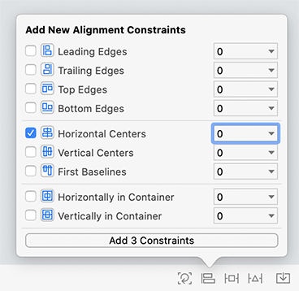
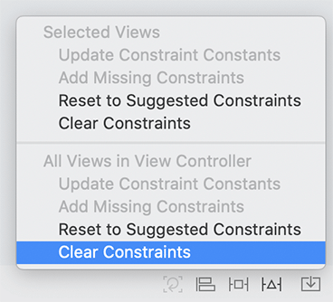

## Model-View-Controller

MVC(Model-View-Controller, 또는 MVC)은 iOS 개발에 사용되는 설계 패턴이다. MVC에서 모든 인스턴스는 모델 계층, 뷰 계층 또는 컨트롤러 계층에 속한다. (여기 레이어는 단순히 함께 역할을 수행하는 하나 이상의 개체를 가리킨다.)

- model 레이어는 데이터를 보유하고 있고 사용자 인터페이스, 즉 UI에 대해서는 아무것도 모른다. 퀴즈에서 모델은 질문용과 답변용 두 개의 문자열 목록으로 구성될 것이다.

  일반적으로 모델 계층의 인스턴스는 사용자의 세계에서 실제를 나타낸다. 예를 들어 보험회사용 앱을 쓸 때 당신의 모델에는 보험정책이라는 맞춤형 유형이 거의 확실히 들어 있을 것이다.

- view 레이어에는 사용자가 볼 수 있는 객체가 포함되어 있다. 뷰 객체 또는 뷰의 예로는 버튼, 텍스트 필드 및 슬라이더가 있다. view 객체가 응용 프로그램의 UI를 구성한다. 퀴즈에서는 문답을 보여주는 라벨과 그 아래 버튼이 뷰 객체다.

-  컨트롤러 계층은 애플리케이션이 관리되는 곳이다. 컨트롤러 객체 또는 컨트롤러는 애플리케이션의 관리자다. 컨트롤러는 사용자가 보는 뷰를 구성하고 뷰와 모델 객체가 동기화 상태를 유지하도록 한다. 일반적으로 컨트롤러는 "그 다음?"를 처리한다. 문의사항 예를 들어 사용자가 목록에서 항목을 선택할 때 컨트롤러는 사용자가 다음에 볼 것을 결정한다.


모델과 뷰가 서로 직접 대화하지 않는다는 점에 유의해야한다. 컨트롤러가 중간에서 메세지를 받고 지시를 발송한다.


## Designing Quiz

MVC 패턴을 이용하여 퀴즈 프로그램을 작성하게 될 겁니다. 생성 및 작업할 인스턴스에 대한 자세한 내용은 다음과 같다.

- 모델 레이어는 [String]의 두 개의 인스턴스로 구성된다.

- 뷰 레이어는 UILabel 인스턴스 두 개와 UIButton 인스턴스 두 개로 구성된다.

- 컨트롤러 계층은 ViewController의 인스턴스로 구성될 것이다.

 이러한 사례와 그 관계는 그림 1.7에 나타난 퀴즈 도표에 제시되어 있다.


그림 1.7은 완성된 퀴즈 어플리케이션의 작동 방식을 보여주는 큰 그림이다. 예를 들어 다음 질문 버튼을 누르면 ViewController에서 메서드가 트리거된다. 메서드는 함수와 매우 유사하며, 실행해야 할 명령의 목록이다. 이 메서드는 질문의 배열에서 새로운 질문을 검색하고 상단 라벨에 그 질문을 표시하도록 요청할 것이다.

이 다이어그램이 아직 이치에 맞지 않더라도 괜찮다. – 1장 말미에 이 다이어그램이 나올 것이다. 앱을 만들 때 다시 참조하여 앱이 어떻게 만들어지고 있는지 확인하자.

응용 프로그램의 비쥬얼 인터페이스를 시작으로 단계별로 퀴즈를 작성하게 된다.

## Interface Builder

Xcode가 제공하는 가장 단순한 템플릿이기 때문에 Single View App 템플릿을 사용하는 겁니다. 그러나 이 템플릿은 일부 중요한 구성요소가 이미 설정되어 있다는 점에서 상당한 마법을 가지고 있다. 현재로서는 이러한 구성 요소가 어떻게 작동하는지 깊이 이해하려고 시도하지 않고 이러한 구성 요소만 사용하십시오. 그 책의 나머지 부분은 그 세부사항과 관련이 있을 것이다.

프로젝트 네비게이터에서 Main.storyboard 파일을 한 번 누르십시오. Xcode는 Interface Builder라고 불리는 그래픽 편집기를 열 것이다. Xcode의 내부 도구 중 하나인 SimulatorTampolin에 대한 허가를 요청받을 수 있다. 그렇다면 허락해 주시오

인터페이스 빌더(Interface Builder)는 편집자 영역을 두 개의 섹션으로 나누는데, 문서 개요는 왼쪽에, 캔버스는 오른쪽에 있다.

이것은 그림 1.8에 나와 있다. 편집기 영역에 표시되는 내용이 그림과 일치하지 않으면 문서 개요 표시 단추를 클릭해야 할 수 있다. (추가된 영역이 있는 경우, 걱정하지 마십시오.) 또한 문서 개요의 공개 삼각형을 눌러 내용을 공개해야 할 수도 있다.


인터페이스 빌더 캔버스에 보이는 직사각형을 씬(scene)이라고 하며, 현재 응용프로그램이 가지고 있는 유일한 "스크린(screen)" 또는 보기를 나타낸다. (이 프로젝트를 만들 때 Single View App 템플릿을 사용했다는 점을 기억하십시오.)

다음 섹션에서는 인터페이스 빌더를 사용하여 응용프로그램에 대한 UI를 만드는 방법에 대해 배운다. Interface Builder를 사용하면 라이브러리에서 캔버스로 객체를 끌어 인스턴스를 생성할 수 있으며 이러한 객체와 코드 간의 연결을 설정할 수도 있다. 이러한 연결은 사용자 상호작용에 의해 코드가 호출되는 결과이다.

인터페이스 빌더의 중요한 특징은 다른 파일에 포함된 코드를 그래픽으로 표현하지 않는다는 것이다. Interface Builder는 객체의 인스턴스를 만들고 그 속성을 조작할 수 있는 객체 편집기다. 인터페이스 편집을 마치면 인터페이스에서 수행한 작업에 해당하는 코드가 생성되지 않는다. .storyboard 파일은 필요할 때 메모리에 로드될 객체 인스턴스들의 아카이브다.

## Building the Interface

당신의 인터페이스로 시작하자. 당신은 캔버스에 하나의 scene을 드러내기 위해 main.storybord를 선택했다.

시작하려면 scene이 아이폰11 프로에 맞는지 확인하십시오. 캔버스 하단에서 view as 단추를 찾으십시오. "View as: iPhone 11 Pro (wC hR). (wC hR은 지금 당장은 말이 되지 않을 것이다. 16장에서 설명하겠다.) 이미 아이폰11 프로라고 적혀있으면 다 준비됐다. 그렇지 않으면 View as(다른 이름으로 보기) 버튼을 클릭하고 iPhone 11 Pro 아이콘(그림 1.9)을 찾아 선택하십시오.

이제 빈 슬레이트에 뷰 객체를 추가할 차례이다.

## CREATING VIEW OBJECTS

응용프로그램 인터페이스에는 사용자 입력을 허용하는 두 개의 버튼과 정보를 표시하는 두 개의 텍스트 라벨로 총 네 개의 뷰 객체가 필요하다. 추가하려면 먼저 Xcode의 오른쪽 상단 모서리에 있는 버튼을 클릭하여 라이브러리를 표시하십시오(그림 1.10). 키보드 단축키인 Command-Shift-L을 사용하여 열 수도 있다.(Command-Option-Shift-L은 라이브러리를 별도의 창에 연다.)


라이브러리에는 인터페이스를 구성하기 위해 스토리보드 파일에 추가할 수 있는 오브젝트가 포함되어 있다. 목록을 아래로 스크롤하거나 라이브러리 상단의 검색을 사용하여 레이블 객체를 찾으십시오. 라이브러리에서 이 객체를 선택하고 캔버스의 뷰 객체로 끌어다 놓으십시오. 캔버스 근처에 라벨을 끌어다 놓으면 라벨이 캔버스 중앙 근처에 있을 때 나타나는 파란색 점선이 보인다(그림 1.11). 이 가이드라인은 인터페이스를 배치하는 데 도움이 될 것이다.


이 가이드라인을 이용하여 그림 1.11과 같이 뷰의 수평 중심과 상단 근처에 라벨을 배치하십시오. 결국 이 라벨은 사용자에게 질문을 표시할 것이다. 라이브러리를 다시 열고 두 번째 레이블을 뷰에 끌어다 놓고 가운데에 가까운 수평 가운데에 놓으십시오(팁: 레이블을 끌면서 옵션을 누르고 있으면 라이브러리는 수동으로 닫을 때까지 열려 있음). 이 라벨에는 답이 표시된다.

다음, 라이브러리에서 button을 찾아 두 개의 button을 view에 끌어다 놓으십시오. 각각의 라벨 아래에 하나씩 놓으십시오.

이제 ViewController의 UI에 4개의 뷰 객체를 추가하셨습니다. 문서 개요(document outline)에도 해당 내용이 표시됨을 참고하십시오. 인터페이스는 그림 1.12와 같아야 한다


## CONFIGURING VIEW OBJECTS

이제 뷰 객체를 생성했으므로 해당 객체의 속성을 구성할 수 있다. 크기, 위치 및 텍스트와 같은 뷰의 일부 속성은 캔버스에서 직접 변경할 수 있다. 예를 들어 캔버스나 document outline에서 객체를 선택한 다음 캔버스에서 모서리와 가장자리를 끌어 개체 크기를 조정할 수 있다.

label과 button의 이름을 바꾸면서 시작하라. 각 label을 두 번 클릭하고 텍스트를 ??로 바꾸십시오. 그런 다음 상단 button을 두 번 누르고 이름을 Next Question으로 변경하십시오. 아래쪽 button의 이름을 Show Answer로 변경하십시오. 그 결과는 그림 1.13에 나타나 있다.


라벨과 버튼의 텍스트를 변경했고, 따라서 그 폭을 변경했기 때문에 더 이상 장면에서 깔끔하게 중앙에 배치되지 않는다는 것을 알아차렸을 것이다. 그림 1.14와 같이 각각을 클릭하고 드래그하여 중심을 다시 잡으십시오.


## RUNNING ON THE SIMULATOR

UI를 테스트하기 위해 Xcode의 iOS 시뮬레이터에서 Quiz를 실행하십시오.

시뮬레이터에서 실행할 Quiz를 준비하려면 Xcode 도구 모음(그림 1.15)에서 활성 구성표 팝업 메뉴를 찾으십시오.


만약 아이폰 11 프로라고 적혀 있다면, 그 프로젝트는 시뮬레이터에서 실행될 예정이고 실행해도 좋다. 다른 기종으로 되어 있으면 클릭해 팝업 메뉴에서 아이폰11 Pro를 선택한다. 아이폰11 프로는 이 책 전반에 걸쳐 시뮬레이터 디폴트가 될 것이다.

도구 모음에서 삼각형 재생 버튼을 클릭하십시오. 이렇게 하면 응용 프로그램이 빌드(compile)된 다음 실행된다. command-R 사용하여 실행할 수 있다.

시뮬레이터가 실행되면 인터페이스 빌더에서 구성한 대로 깔끔하게 중앙에 추가한 모든 view를 가지고 있음을 알 수 있을 것이다.

이제 돌아가서 iPhone 11 Pro Max를 시뮬레이터로 선택하십시오. 애플리케이션을 다시 실행하면 추가한 view들이 여전히 존재하지만 아이폰 11 Pro에서와 같이 중심이 맞지 않는다는 것을 알 수 있다. 라벨과 버튼은 현재 화면에 고정된 위치를 가지고 있고, 메인 뷰를 중심으로 유지되지 않기 때문이다. 이 문제를 해결하기 위해 당신은 "Auto Layout"이라는 기술을 사용할 것이다.

## A BRIEF INTRODUCTION TO AUTO LAYOUT

현재 인터페이스 빌더 캔버스에서는 인터페이스가 괜찮아 보인다. 그러나 iOS 기기는 훨씬 더 많은 화면 크기로 구성되어있고 애플리케이션은 모든 화면 크기와 방향을 지원할 것으로 기대된다. 애플리케이션을 실행하는 장치의 화면 크기나 방향에 관계없이 뷰 객체의 레이아웃이 정확함을 보장할 필요가 있다. 이 작업이 Auto Layout이다.

자동 레이아웃은 장면의 각 뷰 객체에 대한 위치와 크기 제약 조건을 지정하여 작동한다. 이러한 제약조건은 인접 뷰 또는 컨테이너 뷰와 관련될 수 있다. 컨테이너 뷰는 이름에서 알 수 있듯이 다른 보기를 포함하는 뷰 객체일 뿐이다. 예를 들어, Main.storyboard(그림 1.16)에 대한 문서 개요를 살펴보십시오.


문서 개요에서 추가한 레이블과 button이 뷰 객체에 대해 들여쓰기되었음을 알 수 있다. 이 뷰 객체는 레이블과 버튼의 컨테이너로, 객체는 이 뷰에 비례하여 배치하고 크기를 조정할 수 있다.

자동 레이아웃 제약 조건을 지정하려면 캔버스나 문서 개요에서 상단 레이블을 클릭하여 선택하십시오. 캔버스의 하단에서 그림 1.17처럼 표시된 자동 레이아웃 메뉴가 있다.


상단 라벨을 계속 선택한 상태에서 아이콘을 클릭하여 그림 1.18과 같이 Align 메뉴를 표시하십시오.


Align(정렬) 메뉴에서 Horizontally in Container를 선택하여 라벨을 컨테이너 중앙에 배치하십시오. 그런 다음 Add 1 제약 조건 버튼을 클릭하십시오. 이 제약조건은 어떤 크기 화면에서도, 어떤 방향에서든 라벨이 수평으로 중앙에 위치하도록 보장한다.

다른 뷰의 중심을 상단 레이블의 중심에 맞춰 수평으로 배치하십시오. 모든 뷰가 가로로 화면 중앙에 집중되는 효과가 있을 것이다. 상단 라벨에서처럼 컨테이너에 맞춰 정렬하는 것은 어떨까? 만약 그 위치를 변경해야 한다면, 당신은 상단 라벨의 제약조건만 수정하면 되고 나머지 라벨은 그 뒤를 따를 것이다.

command-클릭을 이용하여 4개의 뷰들을 선택하고 정렬메뉴에서 Horizontal Centers를 선택하고 Add 3 Constraints을 클릭해라.



이쯤 되면 네 개의 서브뷰가 모두 수평적인 위치를 갖게 된다. 이제 그들에게 수직적 위치를 주기 위해 제약 조건을 추가해야 한다. 이렇게 하려면 각 뷰와 뷰 위의 뷰 사이의 간격을 잠그십시오. 네 개의 뷰를 선택한 상태에서 아이콘을 클릭하여 그림 1.20에 표시된 새 제약 조건 추가 메뉴를 여십시오.


메뉴 상단 근처에 있는 빨간색 수직 점선 세그먼트를 클릭하십시오. 세그먼트를 클릭하면 각 보기의 거리가 가장 가까운 맨 위 이웃에 고정됨을 나타내는 빨간색이 된다(그림 1.20 참조). 작업을 마치면 메뉴 하단에 있는 4개의 제약 조건 추가 버튼을 클릭하십시오.

만약 당신이 제약조건을 추가하는 동안 실수를 했다면, 당신은 정확한 파란색 선 대신에 빨간색 또는 주황색 제약조건과 테두리를 캔버스에 볼 수 있다. 그런 경우라면 기존의 제약조건을 취소하고 위의 단계를 다시 거치는 것이 좋다. 제약 조건을 다시 적용하면 안된다. 새로운 제약 조건이 이전의 제약 조건을 대체하지 않는다. 이전의 제약조건을 제거할 때까지 불안정한 상태의 제약 조건이 계속 존재할 수 있다.

제약 조건을 지우려면 먼저 배경(컨테이너) 뷰를 선택하십시오. 그런 다음 정렬메뉴 오른쪽 세모 아이콘을 눌러 Resolve Auto Layout Issues 메뉴를 여십시오. View Controller Clear Contracts를 선택하십시오(그림 1.21). 이렇게 하면 추가한 제약 조건이 모두 제거된다.



자동 레이아웃은 숙달하기 어려운 도구가 될 수 있으며, 그래서 당신은 이 책의 첫 장에서 자동 레이아웃을 사용하기 시작하고 있다. 일찍 시작함으로써, 여러분은 그것을 사용하고 그것의 복잡성에 익숙해질 더 많은 기회를 갖게 될 것이다. 또한 일이 너무 복잡해지기 전에 문제를 처리하면 배치 문제를 자신 있게 디버깅하는 데 도움이 될 것이다.

인터페이스가 올바르게 작동하는지 확인하려면 iPhone 11 Pro Max로 시뮬레이터를 실행하십시오. 인터페이스가 올바르게 보이는지 확인한 후, iPhone 11 Pro 시뮬레이터에서 애플리케이션을 빌드하고 실행하십시오. 라벨과 버튼은 둘 다 중앙에 위치해야 한다.

## MAKING CONNECTIONS

연결은 두 개체가 통신할 수 있도록 한 객체가 메모리에 있는 다른 객체가 어디에 있는지 알 수 있게 해준다. 인터페이스 빌더에서 할 수 있는 연결에는 아웃렛과 액션 두 종류가 있다. 아웃렛은 객체를 가리키는 말이다. 액션은 slider나 picker와 같이 사용자가 상호 작용할 수 있는 button이나 다른 뷰에 의해 작동되는 메서드이다.

UILabel의 인스턴스를 참조하는 아웃렛을 만드는 것부터 시작합시다. Interface Builder를 떠나 코드를 작성해보자.

## Declaring outlets

프로젝트 네비게이터에서 ViewController.swift라는 파일을 찾아서 선택하십시오. 에디터 영역이 인터페이스 빌더에서 Xcode의 코드 편집기로 변경될 것이다.

ViewController.swift에서 아래와 같이 class ViewController: UIViewController { } 내부의 모든 내용을 삭제해주세요.

```swift
import UIKit

class ViewController: UIViewController {

}
```

(간단함을 위해 이 파일에서 import UIKit 라인을 다시 보여주지 않을 겁니다.)

다음으로 두 가지 속성을 선언하는 다음 코드를 추가하십시오. (이 책을 통해 당신이 추가할 새로운 코드가 굵게 표시될 것이다. 삭제할 코드는 줄이 그어진다.) 지금 당장 코드나 속성을 이해하는 것에 대해 걱정하지 말고 그냥 받아들여라.

```swift
class ViewController: UIViewController {
    @IBOutlet var questionLabel: UILabel!
    @IBOutlet var answerLabel: UILabel!
}
```

이 코드는 ViewController의 모든 인스턴스에 'questionLabel'이라는 이름의 아웃렛과 'answerLabel'이라는 이름의 아웃렛을 제공한다. 뷰 컨트롤러는 각 아웃렛을 이용하여 특정 UILabel 객체(즉, 뷰의 레이블 중 하나)를 참조할 수 있다. @IBOutlet 키워드는 Xcode에 인터페이스 빌더를 사용하여 이러한 아웃렛 객체에 라벨을 붙이도록 연결한다고 알려준다.

## Setting outlets

프로젝트 탐색기에서 Main.storyboard를 선택하여 인터페이스 작성기를 다시 여십시오.

quest Label 아웃렛이 UI 상단의 UILabel 인스턴스를 가리키도록 하려는 경우.

문서 개요에서 View Controller Scene 섹션과 그 안에서 View Controller 객체를 찾으십시오. 이 경우, View Controller는 Main.storyboard에 정의된 인터페이스를 관리하는 객체인 ViewController의 한 인스턴스를 의미한다.

문서 개요의 View Controller에서 씬(scene)의 상단 레이블로 컨트롤-드래그(또는 마우스 오른쪽 버튼을 클릭하여 끌기) 라벨이 강조 표시되면 마우스와 키보드를 분리하십시오. 그림 1.22와 같이 검은색 패널이 나타난다. 아웃렛를 설정하려면 questionLabel을 선택하십시오.


(연결 패널에 questionLabel이 표시되지 않으면 ViewController.swift 파일에서 오타가 있는지 다시 확인하십시오.)

이제 스토리보드 파일이 로드되면 ViewController의 questionLabel 아웃렛이 scene의 최상단에 있는 UILabel 인스턴스를 자동으로 참조하게 되어 ViewController가 라벨에 표시할 질문을 알려줄 수 있게 된다.

viewController에서 아래쪽 UILabel로 컨트롤-드래그하고 answerLabel(그림 1.23)을 선택하십시오.


당신이 원하는 아웃렛 객체에 올바르게 드래그 해야합니다.

당신의 아울렛은 모두 준비되었다. 다음에 연결하려면 두 개의 단추가 있어야 한다.

## Defining action methods

"UIButton을 탭하면 다른 객체에 대한 메서드를 호출한다. 저 객체는 타겟이라고 불린다. 트리거되는 방법을 동작이라고 하며, 버튼을 누르는 것에 대응하여 실행할 코드를 포함하고 있다.

애플리케이션에서 두 버튼의 타겟은 ViewController 인스턴스가 될 것이다. 각각의 버튼은 각각의 동작을 가질 것이다. 먼저 showNextQuestion(_:)과 showAnswer(_:)"의 두 가지 액션 메서드를 정의해 봅시다.

ViewController.swift를 다시 열고 아웃렛 뒤에 두 가지 액션 메서드를 추가하십시오.

```swift
class ViewController: UIViewController {
    @IBOutlet var questionLabel: UILabel!
    @IBOutlet var answerLabel: UILabel!

    @IBAction func showNextQuestion(_ sender: UIButton) {

    }

    @IBAction func showAnswer(_ sender: UIButton) {

    }
}
```

타겟과 액션을 연결한 후에 이 메서드들을 채워갈 것이다. @IBAcention 키워드는 Xcode에게 당신이 인터페이스 빌더에서 이러한 연결을 만들 것이라고 알려준다.

## Setting targets and actions

메인스토리보드로 다시 전환하십시오. Next Question 버튼부터 시작해보자. 당신은 이 버튼의 타겟을 ViewController로 지정하고 해당 액션을 showNextQuestion(_:)으로 하길 원한다.

객체의 대상을 설정하려면 객체에서 대상으로 제어 드래그하십시오. 마우스를 놓으면 대상이 설정되고 액션을 선택할 수 있는 패널이 나타난다.

캔버스에서 Next Question 버튼을 선택하고 컨트롤-드래그 도큐먼트 외각에 있는 뷰컨트롤러에 연결해라. 뷰컨트롤러가 하리아리트 되고 